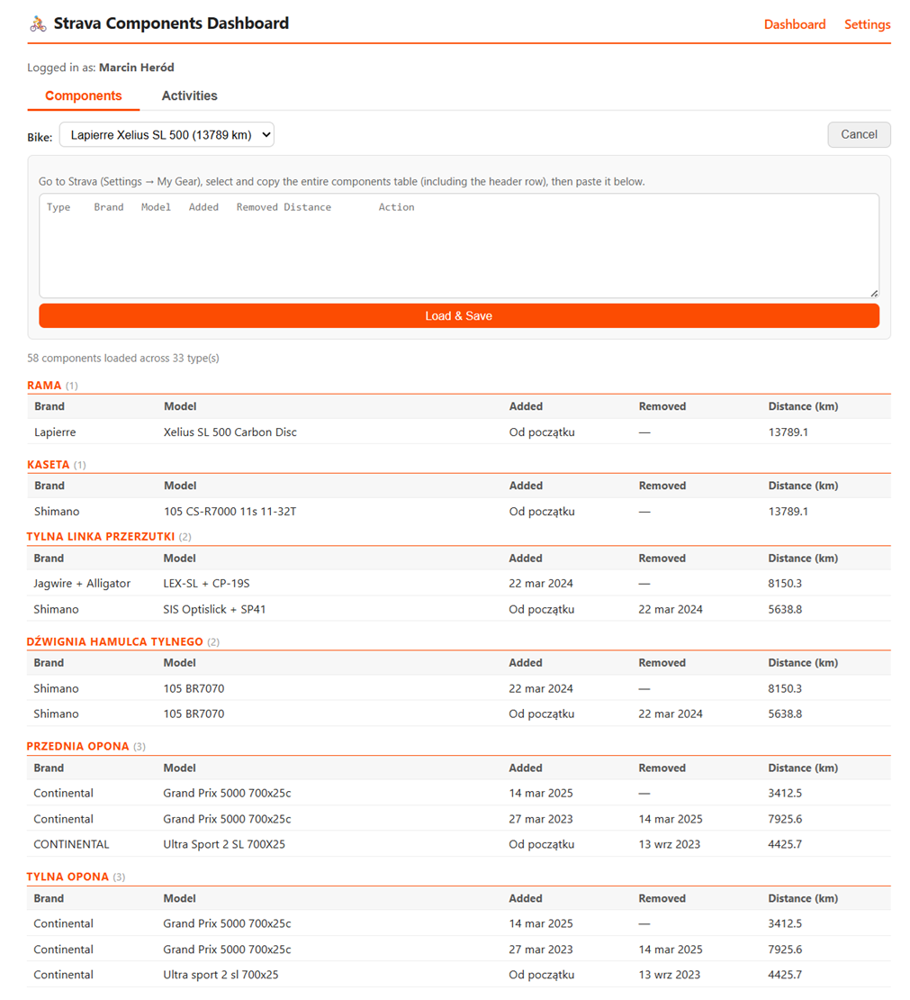
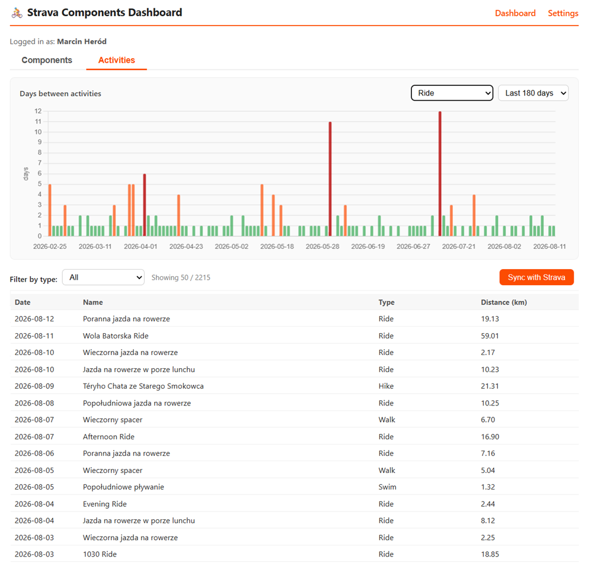
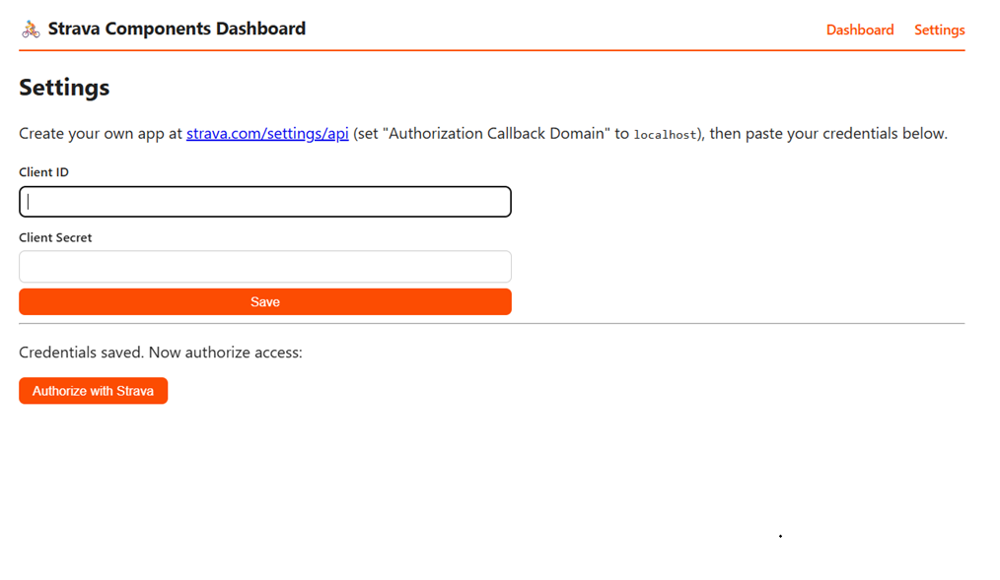

# Strava Components Dashboard

A lightweight personal dashboard for your Strava activities and bike components.
Built with Python (Flask) — one process, no separate frontend build step needed.
All configuration (Client ID / Secret) is done in the browser UI.

## Screenshots

### Components


### Activities


### Settings


## Features

- OAuth2 login with Strava (no manual token editing)
- Sync and browse your activity history with type and page size filters
- Chart showing days between activities, colored by gap length, filterable by type and time period
- Manage bike components by pasting from Strava's gear page
- Auto-detects Polish and English Strava UI format when pasting components
- Components grouped by type, active on top, retired at the bottom
- Select bike from your Strava garage
- Activity names link directly to Strava
- Data stored locally in JSON files (no database required)
- Persistent config — survives restarts without re-login

## Installation

### Option A — Windows one-click (recommended)

Double-click **`install.bat`** in the project folder.
It will check for Python, create a virtual environment, and install all dependencies automatically.

### Option B — Manual (PowerShell)

```powershell
cd strava-dashboard
python -m venv venv
venv\Scripts\activate
pip install -r requirements.txt
```

## Running

| File | What it does |
|---|---|
| `install.bat` | One-time installation (run first) |
| `start_app.bat` | Runs in a terminal window — stops when you close it |

### Option A — Windows one-click

Double-click **`start_app.bat`**. Press `Ctrl+C` to stop.

### Option B — Manual (PowerShell)

```powershell
venv\Scripts\activate
python app.py
```

### Option C — Background mode (Git Bash)

Open **Git Bash** in the project folder (right-click → "Git Bash Here"):

```bash
./start.sh     # start in background
./stop.sh      # stop
tail -f app.log  # live logs
```

## Setup in the browser

Open **http://localhost:5050** — you'll be redirected to `/settings`.

1. Create your own app at [strava.com/settings/api](https://www.strava.com/settings/api)
   (set "Authorization Callback Domain" to `localhost`)
2. Paste your **Client ID** and **Client Secret** into the settings form and save
3. Click **"Authorize with Strava"**, log in and approve access
4. On the dashboard, click **"Sync with Strava"** to fetch your activities
5. In the **Components** tab, click **"Fetch bikes from Strava"** to load your garage

Subsequent syncs only fetch new activities — already saved ones are skipped.

## Adding bike components

Strava's public API does not expose component data, so this dashboard uses a
copy-paste approach:

1. Go to your gear page on Strava (Settings → My Gear)
2. Select and copy the entire components table (including the header row)
3. Paste it into the **Components** tab on the dashboard and click "Load & Save"

Both Polish and English Strava UI formats are supported and auto-detected.
Components are grouped by type, with active ones on top and retired ones at the bottom.

## Project structure

```
strava-dashboard/
├── app.py                  # Flask routes and app logic
├── storage.py              # Read/write local JSON data files
├── strava_client.py        # OAuth2 + Strava API calls
├── components_parser.py    # Parse pasted component tables (PL + EN)
├── requirements.txt
├── install.bat             # Windows one-click installer
├── start_app.bat           # Windows one-click launcher
├── start.sh / stop.sh      # Background mode scripts (Git Bash)
├── docs/screenshots/       # Screenshots for README
├── templates/
│   ├── base.html
│   ├── dashboard.html      # Components + Activities tabs
│   └── settings.html
├── static/style.css
└── data/                   # Created automatically, excluded from git
    ├── config.json         # Client ID/Secret + tokens (never commit this)
    ├── activities.json     # Synced activities
    └── components.json     # Saved bike components
```

## Security note

`data/config.json` contains your Client Secret and access tokens.
It is listed in `.gitignore` and will never be committed to git.
Do not share this file or expose it publicly.